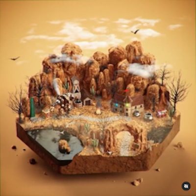

### Table of Contents
> [Title](#-3d-tower-defense) 
> [Genre](#-genre) 
> [Game Insperation](#-game-insperation) 
> [Mechanics](#-mechanics)

 

## [↑](#table-of-contents) 3D Tower Defense

` Premise: the goal would be to prevent enemies from reaching your base. `

## [↑](#table-of-contents) Genre
#### ` Strategy ` ` Tower Defense ` ` Singleplayer ` ` Relaxing `

## [↑](#table-of-contents) Overview

These enemies come in large waves over 3d slides and other such lines weirdness. These enemies are trojan horses. Each enemy houses a smaller weaker enemy or does something interesting on death. (Thing of better idea)

Certain maps have strangeness. Like one map styles have “random” teleporters the player has to deal with.
To prevent the enemy form reaching your base you place allies/buildings/creatures that will attack passing enemies and destroy them. 

Base is upgradable to add replay ability and uniqueness. Ie Make a few different play styles 
Base gives you tiles or ramps or something and you build the map like dorf 
Maybe tiles give resources, bases give tiles per round. 
Tiles make the level. Maybe combo tiles do things 
Decided between tiles that having lanes or the ai decides where it wants to go and you can make the land based on what you have seen. 

Slower pace tower defense game relaxing look at the scenery maybe super artsey art style 

## [↑](#table-of-contents) Game Insperation

[][Tile][][BloonsTD5]
[][Catan]

## [↑](3DTowerDefense.md#table-of-contents) Mechanics
 

| Ideas |
| :--- |
| Unique events in maps |
| Build a base / towers |
| Can Upgrade the base |
| The towers being places are from tiles / deck |
| Tiles give resources and base gives tile per round |
| Tiles have / make up the path |
| Slow paced and relaxing |

[Word Doc](Files/3D_Tower_Defense.docx)
   

> [Back to Home Page](https://github.com/GDD450-Team-Omega/Assets)
>> [Back to Game Pitches](https://github.com/GDD450-Team-Omega/Assets/tree/master/Asset%20Files/Game%20Pitches)

[Tile]: https://www.instagram.com/p/CRyZGsQqEl2/?utm_source=ig_web_copy_link "Click for Original Post (Animated)"
[BloonsTD5]: https://www.youtube.com/watch?v=_dprpzb677A "Click for Bloons TD 5 Trailer"
[Catan]: https://cdn.thingiverse.com/renders/e2/ce/d4/98/98/20160101_133325_preview_featured_preview_featured.jpg "Click for Detailed 3D Board"
