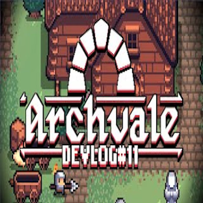

### Table of Contents
> [Title](#-roguelike)<br />
> [Genre](#-genre)<br />
> [Game Insperation](#-game-insperation)<br />
> [Mechanics](#-mechanics)

<br />

# [↑](#table-of-contents) Roguelike

> Starting Idea: wizard of legends ie fast paced dungeon rogue like

## [↑](#table-of-contents) Genre 
#### `Roguelike` ```Beat 'em Up``` `Horror`

## [↑](#table-of-contents) Game Insperation: 

[][Death's Door]  [][Wizard of Legend]
[][Binding of Isaac]  [][Archvale]
[][Enter the Gungeon]  [][Subnautica]
 

## [↑](#table-of-contents) Mechanics 
|    Ideas   |
| :--- |
| Preset Level Generation |
| Procedural Level Generation |
|Story Driven |
| Environment Driven |
| _Horror_ (Scares) |
| Random Weapon Rolls/Stats |
| Stash Items|

##### Maybe you’re a wizard that found an ancient and evil dungeon (or just place) the wizard has a clone of his body so when they die they respawn but with stuff lost. The wizard is unable to damage the creatures so they must mind control and finagle other enemies in to damaging each other and stuff.   Can't directly damage enemies.

[Word Doc](https://liveuwstout-my.sharepoint.com/:w:/g/personal/boehmz8613_my_uwstout_edu/ES2czwkxKb9EmOha0vkILKABpWAZkpiYaEx02vimEnC2Bg?e=EpjbQJ)
<br /><br /><br />

> [Back to Home Page](https://github.com/GDD450-Team-Omega/Assets)
>> [Back to Game Pitches](https://github.com/GDD450-Team-Omega/Assets/tree/master/Asset%20Files/Game%20Pitches)

[Death's Door]: https://www.youtube.com/watch?v=NjnEg3ucXpc "Click Me For Death's Door Trailer"
[Wizard of Legend]: https://www.youtube.com/watch?v=1bsU7iQM66o "Click Me For Wizard of Legend Trailer"
[Binding of Isaac]: https://www.youtube.com/watch?v=27Le3kOOFQk "Click Me For Binding of Isaac Trailer"
[Archvale]: https://www.youtube.com/watch?v=fiDNUQMRhqc "Click Me For Archvale Trailer"
[Enter the Gungeon]: https://www.youtube.com/watch?v=OMh0tw0bADs "Click Me For Enter the Gungeon Trailer"
[Subnautica]: https://www.youtube.com/watch?v=Rz2SNm8VguE "Click Me For Subnautica Trailer"
